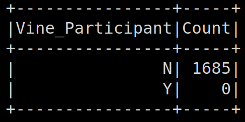
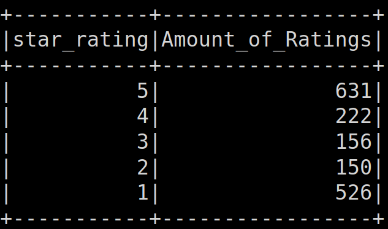

   

[Amazon Vine](https://en.wikipedia.org/wiki/Amazon_Vine) is an Amazon program that wrassles up trustworthy reviewers to provide reviews to companies who pay a fee.

## AMAZON VINE REVIEW GOALS
1. to perform an ETL on raw vine review data 
2. to see if there is any interesting correlations with reviews and vine participation and whether or not there is a bias

## Procedure
Using [Google Collab](https://colab.research.google.com/), you can follow along with the steps using first the ETL notebook first follows by the analysis notebook
## Data  
Of the [possible datasets](https://s3.amazonaws.com/amazon-reviews-pds/tsv/index.txt) we're using video games dataset as a test run. Here is a snapshot of the first 20 rows of data:

## Analysis

### Reviewers

As one can see, there are literally no Vine reviewers for this dataset so it would be impossible to determine if there was a bias in 5 star reviews with vine reviewers.  More data would be needed, preferably actual participants who have at least 20 reviews under their belt.

### Further cleaning of data
From consideration, we removed those reviews where they had less than 20 votes and that the ratio of "helpful" votes to the total amount of votes was >= 50%

### 5-✪ reviews
Since there were literally no Vine reviews in this dataset, we could only see the non-participant input and of all the reviews that had 5 stars. Here is a breakdown of the reviews:

Since we had 1685 reviews in total, the percentage of 5 star reviews was (631 / 1685 * 100) 37.45%

